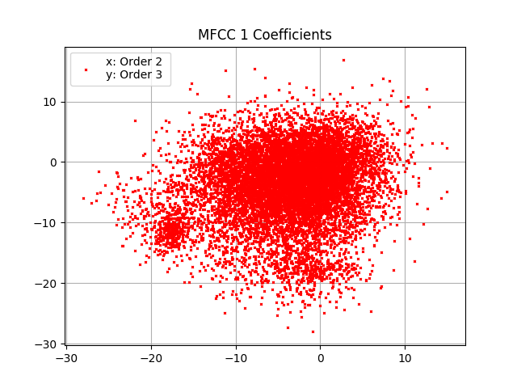
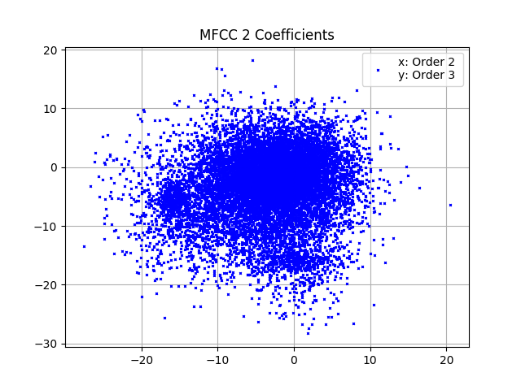
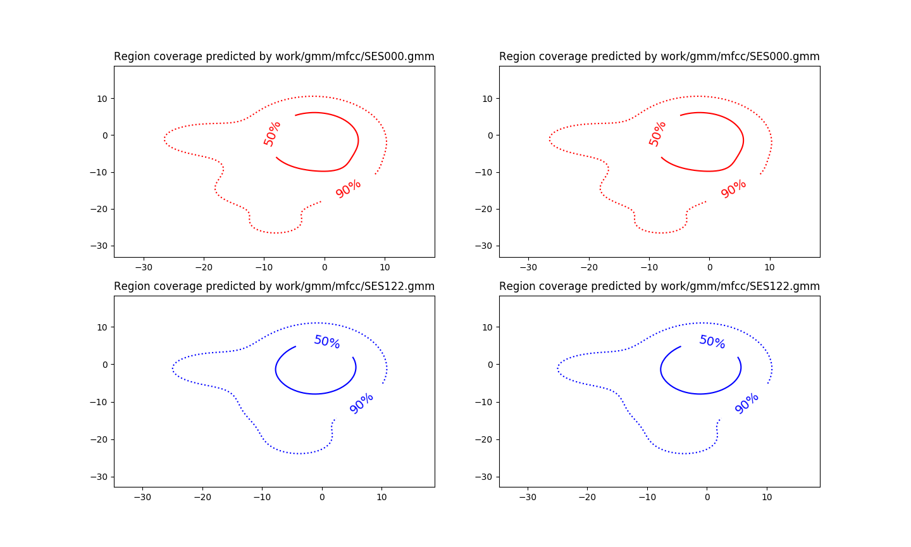

PAV - P4: reconocimiento y verificación del locutor
===================================================
Práctica realizada por: Víctor Emilio y Pau Rodríguez

**RESULTADOS OBTENIDOS (Base de Datos de Entrenamiento)**

* LP (Train: N = 40, m = 15; Trainworld: N = 20, m = 30)  

Núm. de coeficientes: 8

Error rate: 3,69%

Cost detection: 76,2

* LPCC (Train: N = 40, m = 15; Trainworld: N = 20, m = 30)

Núm. de coeficientes: 12

Error rate: 1,27 %

Cost detection: 23,6

* MFCC (Train: N = 50, m = 15; Trainworld: N = 50, m = 15)

Núm. de coeficientes: 16

Núm. de filtros: 25

Error rate: 63,97%

Cost detection: 86

### Entrenamiento y visualización de los GMM.

- Inserte una gráfica que muestre la función de densidad de probabilidad modelada por el GMM de un locutor
  para sus dos primeros coeficientes de MFCC.
  
  
  
  
- Inserte una gráfica que permita comparar los modelos y poblaciones de dos locutores distintos. Comente el
  resultado obtenido y discuta si el modelado mediante GMM permite diferenciar las señales de uno y otro.
 
 